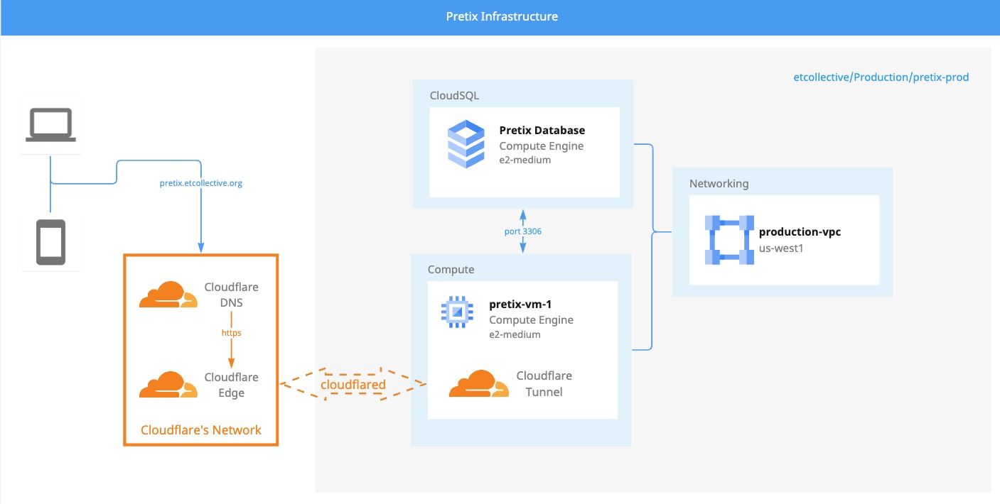

<div align="center">
<h1 align="center">

<br>PRETIX-INFRA</h1>
<h3>◦ Craft & Code, Unleashed: pretix-infra, Infrastructure Simplified!</h3>
<h3>◦ Developed with the software and tools below.</h3>

<p align="center">


</p>


</div>

---

## 📖 Table of Contents
- [📖 Table of Contents](#-table-of-contents)
- [📍 Overview](#-overview)
- [📈 Architecture](#-architecture)
- [📂 repository Structure](#-repository-structure)
- [⚙️ Modules](#modules)
- [🚀 Getting Started](#-getting-started)
    - [🔧 Installation](#-installation)
    - [🤖 Running pretix-infra](#-running-pretix-infra)
    - [🧪 Tests](#-tests)

---


## 📍 Overview

The Pretix-Infra repository leverages Pulumi to manage cloud resources and automates multi-cloud app deployments, primarily on Google Cloud Platform (GCP) and GitHub. It features infrastructure-as-code automation for various cloud functionalities like cloud compute, database management, access management, and tunnel creation. By utilizing GitHub Actions, it also enables continuous integration and deployment, enhancing the software development process. This makes cloud resource management and deployment efficient and accessible.

---
## 📈 Architecture


---
## 📂 Repository Structure

```sh
└── pretix-infra/
    ├── .github/
    │   └── workflows/
    │       └── pulumi.yml
    ├── Pulumi.prod.yaml
    ├── Pulumi.yaml
    ├── __main__.py
    ├── compute.py
    ├── db.py
    ├── iam.py
    ├── requirements.txt
    └── tunnel.py

```

---


## ⚙️ Modules

<details closed><summary>Root</summary>

| File                                                                                        | Summary                                                                                                                                                                                                                                                                                                                                                                                                                                                                                                                 |
| ---                                                                                         | ---                                                                                                                                                                                                                                                                                                                                                                                                                                                                                                                     |
| [db.py](https://github.com/etcollective/pretix-infra/blob/main/db.py)                       | The code uses Pulumi, a coding framework for multi-cloud app deployments in Google Cloud Platform (GCP), GitHub, and other platforms. The script automates the configuration of a PostgreSQL database'pretix' in a GCP project'common-405623', and shares the instance's connection details. Settings, user details, and a password (stored as a secret using Google Secret Manager) are defined. The data is then exported to both GitHub Actions and Pulumi's output.                                                 |
| [requirements.txt](https://github.com/etcollective/pretix-infra/blob/main/requirements.txt) | The code provides an overview of a project in the'pretix-infra' directory, utilizing Pulumi-an open-source infrastructure as code tool. The project applies various Pulumi's libraries (GCP, Random, Github, Cloudflare) to manage cloud resources. Inside it has Python scripts ('compute.py','db.py','iam.py','tunnel.py') related to cloud functionalities. It also defines a CI/CD workflow under '.github/workflows/pulumi.yml' for automated deployment processes.                                                |
| [iam.py](https://github.com/etcollective/pretix-infra/blob/main/iam.py)                     | The code in'iam.py' creates an Ansible Service Account on Google Cloud Platform (GCP) for the'pretix-prod' project using the Python library, Pulumi. Pulumi enables users to manage cloud resources using code. The'ResourceOptions' ensures the service account ('ansible') is protected, preventing accidental deletion or modification.                                                                                                                                                                              |
| [Pulumi.prod.yaml](https://github.com/etcollective/pretix-infra/blob/main/Pulumi.prod.yaml) | The given code represents a configuration file for the project pretix-infra. The infrastructure components include compute resources marked by hostname, machine type, SSH-key, and zone under a GCP project. Region and zone details are specified for GCP. Github credentials for the owner are stored securely. The project uses an ansible repository for configuration management. The main functionalities are defined in Python scripts like compute.py, db.py, iam.py, and tunnel.py within the same directory. |
| [tunnel.py](https://github.com/etcollective/pretix-infra/blob/main/tunnel.py)               | The provided Python code uses the Pulumi framework to automate infrastructure management for Cloudflare tunnels and DNS records. The `tunnel.py` file sets up a Cloudflare tunnel, generates a secure random ID as a tunnel secret, and creates DNS records for the'Pretix Tunnel'. Additionally, it creates an ingress rule for services via the tunnel, manages tunnel configuration, and also sets up a GitHub actions secret tying it to the tunnel secret. Finally, a DNS record is set up and managed by Pulumi.  |
| [Pulumi.yaml](https://github.com/etcollective/pretix-infra/blob/main/Pulumi.yaml)           | The code signifies a Pulumi configuration for the'pretix-infra' project. It utilizes Python as its runtime within a virtual environment'venv'. The project files include Python scripts for handling compute, database, Identity & Access Management (IAM), and tunnel operations. The Pulumi.yml file within workflows likely handles automated tasks like CI/CD. It's primarily designed for managing the infrastructure of Pretix Ticket Sales.                                                                      |
| [__main__.py](https://github.com/etcollective/pretix-infra/blob/main/__main__.py)           | This Python script dynamically imports all Python modules in its current directory, except for the'__main__.py' module itself. It's employed in a'pretix-infra' project that uses Pulumi for infrastructure-as-code, with a potential GitHub Action workflow for Pulumi. The script acts as an entry point for the application and is expected to import other modules like'compute.py','db.py','iam.py', and'tunnel.py', which likely define the infrastructure components.                                            |
| [compute.py](https://github.com/etcollective/pretix-infra/blob/main/compute.py)             | The'compute.py' script in the'pretix-infra' directory sets up a Google Compute Engine with a specified disk size, machine type, and an SSH key using Pulumi. It retrieves a public production subnet for the project and reserves a standard network tier IP address. The VM instance, named'pretix-prod-1', is configured with boot disk parameters and linked to the reserved IP via the network interface. The script uses disk image'debian-12' and disk type'pd-balanced'.                                         |

</details>

<details closed><summary>Workflows</summary>

| File                                                                                              | Summary                                                                                                                                                                                                                                                                                                                                                                                                                                                            |
| ---                                                                                               | ---                                                                                                                                                                                                                                                                                                                                                                                                                                                                |
| [pulumi.yml](https://github.com/etcollective/pretix-infra/blob/main/.github/workflows/pulumi.yml) | The code sets up a GitHub Actions workflow called Pulumi, configured to execute on'push' or'pull_request' events on the main branch. It orchestrates several tasks, including Google Cloud authentication, Python setup, and Pulumi commands for infrastructure previews and updates. It also makes use of various sensitive data stored in repository secrets, like API tokens and cloud credentials. All execution steps are performed in an Ubuntu environment. |

</details>

---

## 🚀 Getting Started

***Dependencies***

This program uses the following Python dependencies:

`- ℹ️ pulumi>=3.0.0,<4.0.0`

`- ℹ️ pulumi-gcp>=7.0.0,<8.0.0`

`- ℹ️ pulumi-random>=4.14.0,<5.0.0`

`- ℹ️ pulumi-github>=5.22.0,<6.0.0`

`- ℹ️ pulumi-cloudflare>=5.15.0,<6.0.0`

---
### 🔧 Usage
---

1. Clone the pretix-infra repository:
```sh
git clone https://github.com/etcollective/pretix-infra
```

2. Change to the project directory:
```sh
cd pretix-infra
```

3. Install the dependencies:
```sh
pip install -r requirements.txt
```

4. Select the Pulumi Stack:
```sh
pulumi stack select $STACK_NAME
```


### 🤖 Running pretix-infra

```sh
pulumi up
```

### 🧪 Preview Changes
```sh
pulumi preview
```